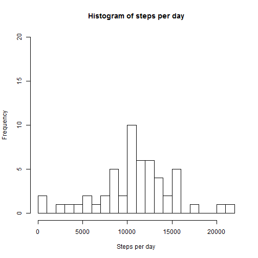
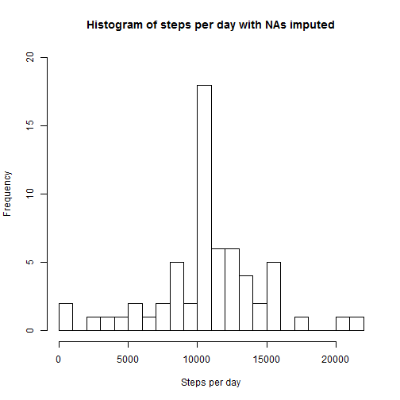

###Introduction

It is now possible to collect a large amount of data about personal movement using activity monitoring devices such as a Fitbit, Nike Fuelband, or Jawbone Up. These type of devices are part of the "quantified self" movement - a group of enthusiasts who take measurements about themselves regularly to improve their health, to find patterns in their behavior, or because they are tech geeks. But these data remain under-utilized both because the raw data are hard to obtain and there is a lack of statistical methods and software for processing and interpreting the data.

This assignment makes use of data from a personal activity monitoring device. This device collects data at 5 minute intervals through out the day. The data consists of two months of data from an anonymous individual collected during the months of October and November, 2012 and include the number of steps taken in 5 minute intervals each day.

The data for this assignment can be downloaded from the course web site:

Dataset: Activity monitoring data [52K] <https://d396qusza40orc.cloudfront.net/repdata%2Fdata%2Factivity.zip>

The variables included in this dataset are:

- **steps**: Number of steps taking in a 5-minute interval (missing values are coded as NA)
- **date**: The date on which the measurement was taken in YYYY-MM-DD format
- **interval**: Identifier for the 5-minute interval in which measurement was taken


###Loading and preprocessing the data

The dataset is stored in a comma-separated-value (CSV) file and there are a total of 17,568 observations in this dataset.

Your working directory may differ.


```r
setwd('C:/Courses/Coursera/Data Science (Hopkins)/DS5 Reproducible Research/Projects/Project 1')
activity_data <- read.csv('activity.csv')
```

How many missing values are present?


```r
missing <- is.na(activity_data$steps)
mean(missing) # 0.1311475, i.e., 13.1%
```

```
## [1] 0.1311475
```

There are no missing values in other columns.


```r
sum(is.na(activity_data$date))
```

```
## [1] 0
```

```r
sum(is.na(activity_data$interval))
```

```
## [1] 0
```

What does the data look like?


```r
head(activity_data)
```

```
##   steps       date interval
## 1    NA 2012-10-01        0
## 2    NA 2012-10-01        5
## 3    NA 2012-10-01       10
## 4    NA 2012-10-01       15
## 5    NA 2012-10-01       20
## 6    NA 2012-10-01       25
```

Data is in a usable form as is, although we'll have to address missing values later.


###What is mean total number of steps taken per day?

For now, we'll ignore the missing values.

Calculate the total number of steps taken per day


```r
steps_per_day <- tapply(activity_data$steps, activity_data$date, sum, rm.na=TRUE)
```

Make a histogram of the total number of steps taken each day


```r
hist(steps_per_day, breaks=20, ylim=c(0,20), xlab='Steps per day', main='Histogram of steps per day')
```



Calculate and report the mean and median of the total number of steps taken per day


```r
mean(steps_per_day, na.rm=TRUE)
```

```
## [1] 10767.19
```

```r
median(steps_per_day, na.rm=TRUE)
```

```
## [1] 10766
```


###What is the average daily activity pattern?

Make a time series plot (i.e. type = "l") of the 5-minute interval (x-axis) and the average number of steps taken, averaged across all days (y-axis).

First, put the intervals into hh:mm format.


```r
hhmm <- strptime(sprintf("%04d", as.numeric(levels(as.factor(activity_data$interval)))), format="%H%M", tz="EST")
```

Now calculate the means and construct the plot.


```r
mean_steps_per_interval <- tapply(activity_data$steps, activity_data$interval, mean, na.rm=TRUE)
plot(hhmm, mean_steps_per_interval, type='l', xlab='Time of day (hh:mm)', ylab='Average number of steps', main='Average number of steps per 5-minute interval')
```


Which 5-minute interval, on average across all the days in the dataset, contains the maximum number of steps?


```r
max_interval <- which(mean_steps_per_interval == max(mean_steps_per_interval))
max_mean <- mean_steps_per_interval[max_interval]
max_interval_time <- strftime(hhmm[max_interval], format="%R")
```

The max interval is the 5-minute interval starting at **08:35** with an average number of steps = **206.17**.


###Imputing missing values

Calculate and report the total number of missing values in the dataset (i.e. the total number of rows with NAs).


```r
sum(is.na(activity_data$steps))
```

```
## [1] 2304
```

We saw earlier that *steps* is the only column with missing values.

To impute the missing values, we will replace NAs in the original dataset with the mean for the interval in which the NA appears.


```r
activity_data_imputed <- activity_data
activity_data_imputed[missing,"steps"] <- mean_steps_per_interval[as.character(activity_data_imputed[missing,"interval"])]
```

Create a new dataset that is equal to the original dataset but with the missing data filled in.


```r
imputed_steps_per_day <- tapply(activity_data_imputed$steps, activity_data_imputed$date, sum, rm.na=TRUE)
```

Make a histogram of the total number of steps taken each day.


```r
hist(imputed_steps_per_day, breaks=20, ylim=c(0,20), xlab='Steps per day', main='Histogram of steps per day with NAs imputed')
```



Calculate and report the mean and median total number of steps taken per day.


```r
mean(imputed_steps_per_day)
```

```
## [1] 10767.19
```

```r
median(imputed_steps_per_day)
```

```
## [1] 10767.19
```


The missing values in the original data are distributed such that either all values for a day were missing or none were. As a result, the method used to impute missing values (namely, replacing each missing value by the average of non-missing values for that missing value's interval) has the effect of making the day's total for each day that has missing values equal to the overall mean for all non-missing values.

Therefore, the histogram using the imputed values is the same as the original histogram except that the frequencies for the overall mean value are higher. I.e., the bar for the bin to the right of 10,000 is higher. The mean is also unchanged, for the same reason. The median, however, does shift slightly.

If the missing values had been distributed differently, so that there were a few missing values sprinkled here and there in a given day's results, the affect on the histogram would not have been confined to the bar corresponding to the overall average.


###Are there differences in activity patterns between weekdays and weekends?

We continue to use the dataset with missing values imputed.

Create a new factor variable in the dataset with two levels - "weekday" and "weekend" indicating whether a given date is a weekday or weekend day.


```r
wd <- weekdays(as.Date(as.character(activity_data_imputed$date)))
wd2 <- sapply(wd, function(x) { if (x %in% c('Saturday', 'Sunday')) 'weekend' else 'weekday'})
activity_data_imputed$wdf <- as.factor(wd2)
```

Make a panel plot containing a time series plot (i.e. type = "l") of the 5-minute interval (x-axis) and the average number of steps taken, averaged across all weekday days or weekend days (y-axis). 

First, we split the data into two sets, one for weekdays and one for weekends, calculate their respective means, then combine the results into a single data frame for plotting.


```r
split_data <- split(activity_data_imputed, activity_data_imputed$wdf)
mean_steps_per_interval_split <- lapply(split_data, function(x) tapply(x$steps, x$interval, mean)) 
df1 <- data.frame(hhmm, mean_steps_per_interval_split[[1]], 'weekday')
names(df1) <- c('interval', 'steps', 'wdf')
df2 <- data.frame(hhmm, mean_steps_per_interval_split[[2]], 'weekend')
names(df2) <- c('interval', 'steps', 'wdf')
df_combined <- rbind(df1, df2)
```

And now, the plot.


```r
library(ggplot2)
library(scales)
xlim <- as.POSIXct(c("2016-02-06 00:00", "2016-02-07 00:00"), format="%Y-%m-%d %H:%M", tz = "EST")
ggplot(df_combined, aes(interval, steps, group=wdf)) + geom_line() + facet_grid(wdf ~ .) + 
    xlab('Time of day (hh:mm)') + ylab('Average number of steps') +
    ggtitle("Average Number of Steps Per 5-Minute Interval: Weekdays v. Weekend") +
    scale_x_datetime(labels = date_format("%H:%M",tz="EST"), breaks = date_breaks("4 hour"), limits=xlim) +
    theme(strip.text.x = element_text(size=8, angle=75),
          strip.text.y = element_text(size=12, face="bold"),
          strip.background = element_rect(colour="red", fill="#CCCCFF"))
```


